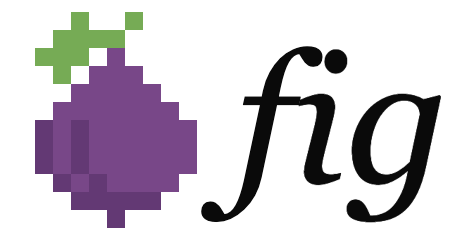
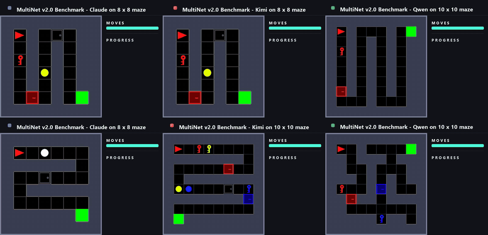

<p align="center">
  <kbd>
  
  <h1 align="center" style="display: inline-block; vertical-align: middle; margin-left: 20px;">An early preview into MultiNet v2.0: Benchmarking Long-Horizon Action Taking and Causal Reasoning Capabilities in Frontier Vision-Language Models</h1>
  </kbd>
</p>

<p align="center">
  <a href="https://multinet.ai/"></a>
  <a href="https://metarch.ai/blog"></a>
  <a href="https://github.com/ManifoldRG/MultiNet"></a>
  <a href="https://discord.gg/Rk4gAq5aYr"></a>
  <a href="./LICENSE"></a>
</p>
<!-- HUMAN: swap the Technical Report badge URL for the real Fig blog post before launch -->

### MultiNet is a collaborative initiative with contributions from leading research teams at institutions like:

<p align="center">
  <a href="https://metarch.ai/" target="_blank">
    <kbd>
    
    </kbd>
  </a>
  <a href="https://www.manifoldrg.com/" target="_blank">
    <kbd>
    
    </kbd>
  </a>
  <a href="https://www.gatech.edu/" target="_blank">
    <kbd>
    
    </kbd>
  </a>
  <a href="https://www.tufts.edu/" target="_blank">
    <kbd>
    
    </kbd>
  </a>
</p>

<p align="center">
  
  <br>
  <em>Claude Opus 4.8, Kimi K2.6 and Qwen 3.6 27B models failing on 2D mazes.</em>
</p>

## 🔍 What this release is

**R1 is the first release of MultiNet v2.0, and a preview of the full cross-domain benchmark we are building.**

We ask a question a single benchmark number cannot answer: when a model has to act over a long horizon in an environment whose rules it has *not* been told, where exactly does it break? R1 puts three frontier VLMs into 2D mazes built so that every source of difficulty is an independent knob, and a failure can be attributed rather than merely recorded.

The maze is a *substrate*, not a domain. Because its structure carries no domain content, the same underlying task can be projected into other modalities — 3D simulation, pure language — and a model evaluated across all of them. This repository is the environment and evaluation machinery behind that first run.

## 🧩 What we built

- **The environment** — 8×8 to 14×14 [MiniGrid](https://github.com/Farama-Foundation/Minigrid) mazes with a six-action space (turn left, turn right, move forward, pickup, toggle, done). The agent must navigate walls and dead ends, operate mechanisms in the right order, and reach a goal tile. Beyond the task instruction and the action space, **nothing about the environment is explained** — how a mechanism works has to be discovered by acting and observing.
- **Mechanisms that isolate distinct capabilities** — keys and doors (operating a mechanism the model has priors for), switches and gates (discovering one it does not), dependency chains (reasoning about ordering), and distractors (error recovery). Each can be added or removed independently of the others.
- **A validator and BFS oracle** — every maze is confirmed solvable, with checks for mechanism necessity, chain ordering, and distractor safety. The oracle yields the exact optimal action sequence from any reachable state, giving objective difficulty, partial credit, and the ability to label a single move as strictly wrong.
- **An evaluation harness** — a config-driven episode runner (prompt assembly, strict action parsing, per-episode artifact logging, a progress-stall watchdog, difficulty-relative step caps), model adapters behind one interface, mechanism-aware scoring, and fleet tooling for large sweeps.
- **An ablation-derived protocol** — 540 episodes across 12 conditions on held-out mazes, varying one field at a time, settled the evaluation protocol before any benchmark numbers were produced.

## 📊 A first look at the results

We evaluated **Claude Opus 4.8** (xhigh thinking), **Kimi k2.6** (thinking), and **Qwen3.6-27B** (thinking) on 50 difficulty-balanced mazes, with an equal 64k output-token budget.

| | Claude Opus 4.8 | Kimi k2.6 | Qwen3.6-27B |
|---|--:|--:|--:|
| **Mazes solved (/50)** | **4** | **1** | **1** |
| Mean action progress | 0.19 | 0.23 | 0.23 |

**6 solves out of 150 episodes. 45 of the 50 mazes were solved by no model at all.** These are puzzles a person who has never seen one solves in a few minutes.

<p align="center">
  
  <br>
  <em>Progress per maze (columns) per model (rows); stars mark the six solves. Median closest approach is 47.5 executable actions from the goal — outside the six solves, nothing came close.</em>
</p>

- **Path length dominates difficulty.** Mazes of ≤30 optimal moves gave 5 solves in 39 episodes; mazes of ≥61 moves gave 0 in 66. No 14×14 maze was ever solved.
- **Mechanisms without priors break models.** Across 105 switch-maze episodes there were **zero** solves: 132 TOGGLE actions produced 2 switch flips, and models stood on a live switch in 38 of those episodes without ever flipping it. Key-door mazes — same structure, but with priors — produced 27 key pickups, 15 door opens, and 4 of the 6 total solves.
- **Extended reasoning buys survival, not solves.** Kimi and Qwen spend 20–26× the output tokens per newly discovered tile that Claude does and survive ~1.6× longer, yet solve fewer mazes.
- **Each model fails in its own style.** Claude walks into walls, Kimi re-treads ground it has already covered, and Qwen turns in place while its rate of reaching new tiles collapses.

Full analysis — difficulty regressions, failure taxonomy, test-time-compute study, scope and limitations — is in the [technical report](https://metarch.ai/blog).

## 🚀 Quickstart

```bash
git clone --recurse-submodules https://github.com/ManifoldRG/MultiNet-v2.0.git
cd MultiNet-v2.0

conda create -n multinet-v2 python=3.10 && conda activate multinet-v2
# (or: python -m venv .venv && source .venv/bin/activate)
pip install -e ".[dev,visual]"

pytest   # verify the install — no API keys or GPU needed
```

Mazes are declarative JSON task specifications. Validate every example spec in the repo and rank them by difficulty:

```bash
python -m gridworld.task_validator
```

```
  [PASS] tier3_key_switch_001: optimal=30 steps, mechanisms=4, score=70.61
  ...
=== Summary: 16/16 tasks beatable ===
```

To build your own maze, copy a spec from `gridworld/tasks/`, edit the layout and mechanisms, then validate and render it:

```python
from PIL import Image

from gridworld.task_spec import TaskSpecification
from gridworld.task_validator import compute_difficulty
from gridworld.backends.minigrid_backend import MiniGridBackend

spec = TaskSpecification.from_json("gridworld/tasks/tier3/key_switch_001.json")

report = compute_difficulty(spec)
print(report.is_beatable, report.optimal_steps, report.mechanism_count)

backend = MiniGridBackend()
backend.configure(spec)
backend.reset(seed=0)
Image.fromarray(backend.render()).save("maze.png")
```

`compute_difficulty` runs the BFS oracle: if your maze is unsolvable, has a decorative mechanism, or has a distractor that can strand the agent, it will tell you.

## 🗺️ Repository structure

| Path | Contents |
|---|---|
| `gridworld/` | task specification, maze validator, BFS oracle, MiniGrid + MultiGrid backends |
| `interface/` | episode runner, prompt assembly, action parsing, model adapters |
| `prompting_experiments/` | every prompt template used in the protocol sweep (none inline) |
| `scorer/` | static and runtime scoring, mechanism-aware progress |
| `demo/` | the playable maze demo embedded on the website |
| `scripts/` | evaluation pipeline entrypoints and run tooling |
| `deploy/` | fleet provisioning and teardown with cost-safety rails |
| `docs/` | design documentation ([index](./docs/README.md)) |
| `tests/` | pytest suite (1000+ tests) |

## 🔭 What's next

R1 covers one rendering of one substrate. The full version of MultiNet v2.0 projects the *same* underlying task into additional domains — 3D simulation and pure language among them — so a model can be evaluated on identical structure across different modes of perception and action spaces. That contrast is what turns a benchmark score into a measurement of generalization rather than interface familiarity.

Because difficulty here is a set of knobs rather than a fixed set of puzzles, the benchmark scales with the models instead of saturating, and every maze is newly generated rather than drawn from anything a model could have trained on.

## 📚 MultiNet archive

MultiNet v1.0 and earlier — evaluating VLMs, VLAs, and generalist models across robotics, multimodal understanding, and procedurally generated game environments — live in the [MultiNet v1.0 repository](https://github.com/ManifoldRG/MultiNet).

## 🙏 Acknowledgments

The runtime builds on [MiniGrid](https://github.com/Farama-Foundation/Minigrid) and [Gymnasium](https://github.com/Farama-Foundation/Gymnasium). We also build on [OGBench](https://github.com/seohongpark/ogbench) (MIT License, © 2024 OGBench Authors) and vendor a fork at [ManifoldRG/ogbench](https://github.com/ManifoldRG/ogbench) with maze-generation and correctness fixes.

<!-- HUMAN: add the reviewer acknowledgments from the technical report (Victor Barres, Yuansheng Ni, Greg Kamradt, et al.) -->

## 📜 Citation

If you use MultiNet v2.0 in your research, please cite:

```bibtex
@misc{guruprasad2026multinetv2,
      title={Frontier Vision-Language Models Fail Simple 2D Mazes: Benchmarking
             Long-Horizon Action Taking and Causal Reasoning Capabilities},
      author={Pranav Guruprasad and Sean Rivera and Helen Lu and Arushi Jain
              and Hangliang Ren and Harshvardhan Sikka},
      year={2026},
      note={TODO — arXiv link},
      }
```
<!-- HUMAN: replace the note with the arXiv eprint once the preprint is up -->

## 🤝 Contributing & contact

Issues and PRs are welcome. Feedback from researchers working on living benchmarks, long-horizon agentic evaluation, and RL environments is especially valuable to us as we build the full cross-domain benchmark.

For collaboration or evaluation services, reach us via [multinet.ai](https://multinet.ai) or [pranav@metarch.ai](mailto:pranav@metarch.ai).

Released under the [MIT License](./LICENSE).
